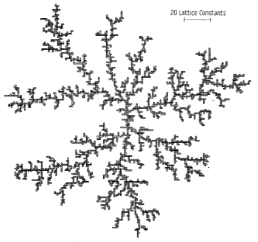

---
meta:
    author: Alec Snodgrass
    topic:  Diffusion Limited Aggregation
    course: TN Tech PHYS 4130
    term:   Spring 2026
---
# **Diffusion Limited Aggregation**

# Introduction

Diffusion-Limited Aggregation (**DLA**) is a stochastic growth process that produces fractal structures through the repeated deposition of randomly moving particles. The concept was first introduced by [Witten and Sander (1981)](./Witten&Sanders.pdf), DLA provides a model for pattern formation in systems where movement is dominated by diffusion and particle attachment occurs upon contact. Despite its simplicity, the model captures essential features observed in a wide range of physical phenomena, including electrodeposition, dielectric breakdown, viscous fingering, and cluster growth in colloidal suspensions. The resulting aggregates are complex, branched structures [Figure 1] which make them an interesting subject for studying fractal geometry and scaling behavior.
<figure>
  
  <figcaption><strong>Figure 1.</strong> Witten and Sander DLA Aggregate of 3600 Particles.</figcaption>
</figure>

In this project, a Monte Carlo simulation is used to model DLA on a discrete lattice. Particles are introduced one at a time and undergo random walks that approximate *Brownian motion*. When a particle steps to a coordinate adjacent to an existing cluster particle, it may irreversibly attach, contributing to the growth of the aggregate. Then, the next particle is introduced, and the process repeats. This implementation extends the classical DLA model by introducing a *stickiness parameter* $( S \in (0,1] )$, which probabilistically governs whether a particle *sticks* to the cluster upon contact. This modification allows for exploration of how varying the attachment probability influences the morphology of the clusters. The simulation is designed to generate visualizations of the cluster growth at predetermined intervals, enabling qualitative assessment of the evolving structure.

A central objective of this study is to quantify the geometry of the resulting aggregates. Unlike regular *Euclidean objects*, DLA clusters exhibit fractal behavior, meaning their structure is self-similar across scales and cannot be characterized by an integer dimension. Instead, the system is analyzed using the *capacity (box-counting) dimension* and the *topological dimension*.

- Euclidean objects are fundamental geometric shapes that can be described by integer dimentions, such as points, lines, planes, and solids. 
- Self-similarity is a property where a structure appears the same, or similar, at different scales. Meaning that zooming in on a portion of the structure reveals a smaller version of the whole. 
- The capacity dimension is a measure of the complexity of a *strange attractor*, which quantifies how the number of boxes needed to cover the cluster scales with the size of the boxes.
- The topological dimension is a fundamental property describing the intrinsic dimensionality of a space (e.g., a curve is one-dimensional, a surface is two-dimensional), independent of scaling behavior.

The simulation framework developed here enables direct computation of the capacity dimension through box-counting methods, as well as a radial analysis of mass scaling. These tools allow for comparison with the canonical result reported by Witten and Sander, who found a fractal dimension of approximately $(D \approx 1.65)$ for two-dimensional DLA. Reproducing this result serves as a validation of the numerical model.

In addition to replication, this work investigates how the capacity dimension varies as a function of the stickiness parameter $(S)$. Lower values of $(S)$ introduce additional stochasticity in the attachment process, potentially leading to denser, less branched aggregates. Understanding this relationship provides insight into how microscopic interaction rules influence macroscopic morphology. This project demonstrates how relatively simple probabilistic rules can give rise to complex emergent structures, and how computational methods can be used to characterize their properties.


# Methodology

## Overview 

The Diffusion-Limited Aggregation (DLA) simulation was implemented in Python using an object-oriented approach. A single class, `DLA`, encapsulates all data structures and algorithms required to simulate particle diffusion, aggregation, and post-processing analysis. This design improves modularity, readability, and extensibility, allowing individual components of the simulation to be modified or analyzed independently. The class structure implementation is by far the biggest improvement in coding style compared to previous projects in this class. 

The following sections provide a detailed explanation of the key *methods* used in the 'DLA' class. Each method is described in terms of its purpose, inputs, outputs, and the underlying algorithms. The methods are organized according to their role in the simulation process, starting with initialization and particle motion, followed by cluster evolution and fractal analysis.

## Class Structure

### `__init__(self, stickiness, max_particles)`

This method initializes the simulation environment and key parameters:

- **Grid construction**: A square lattice is created using a NumPy array. Its size is determined dynamically based on the expected fractal dimension $( D \approx 1.65 )$ and the total number of particles $(N)$, using the scaling relation $R \sim N^{1/D}$.
- **Seed placement**: The initial particle is placed at the center of the grid.
- **Simulation parameters**:
  - `stickiness`: $( S \in (0,1] )$ Probability parameter  controlling adhesion.
  - `max_particles`: Total number of particles to be aggregated.
  - `max_steps`: Upper bound on the number of steps a particle may take before being reset.
- **Cluster tracking**:
  - A list of particle coordinates is maintained.
  - The cluster radius is updated dynamically to reflect growth.
- **Kill radius**:
  - A boundary beyond which particles are considered lost and reinitialized.

## Particle Introduction and Motion

### `new_particle(self)`

Generates a new particle on a circular boundary surrounding the current cluster. When the cluster is small (e.g., just the seed particle), this method effectively spawns particles uniformly around the center - on an equipotential surface. As the cluster grows, the method continues to introduce particles at a fixed distance from the cluster edge, ensuring that they start their random walk from a reasonable location. For small enough `max_particles`, this method is sufficient to produce a well-formed cluster. However, for larger `max_particles`, the cluster grows large enough that one or more **branches** start to form. In this case, the particles are more likely to stick to the branches and increase the growth rate of those branches, leading to anisotropic growth. This problem was discussed by Witten and Sander in the original paper. The solution involves Laplace's equation and finding an equipotential line/surface for particle introduction. **Yuck**, that method can be computationally expensive and difficult to implement.

The implementation in this project avoids this problem by introducing a method of tracking the **angular density** of particles in the cluster. This method computes a histogram of particle density as a function of the angle from cluster center. The angular density is then used to bias the spawning of new particles, preferentially introducing them in less populated directions to encourage more isotropic growth. The implementation of this method is described in the `compute_angular_density` section below.

The method proceeds as follows:

1. The angular density histogram is computed using `compute_angular_density()`, which returns both the normalized histogram and the corresponding bin centers.
    - ```python
      hist, bin_centers = self.compute_angular_density()
      ```

2. The bias for spawning new particles is calculated based on the angular density. Less populated angles are given higher weights to encourage growth in those directions. Then the weights are normalized to form a valid probability distribution for random sampling.
    - ```python
      weights  = (1 - hist)**2 
      weights /= np.sum(weights) 
      ```

3. A random angle bin is selected based on the computed weights, and the spawn angle $\theta$ is set to the center of the selected bin.
    - ```python
      idx   = np.random.choice(len(bin_centers), p=weights)
      theta = bin_centers[idx]
      ```

4. A random offset within the bin is added to determine the final angle for particle introduction.
    - ```python
      bin_width = bin_centers[1] - bin_centers[0]
      theta    += random.uniform(-bin_width/2, bin_width/2)
      ```

5. The particle is placed at a radius slightly larger than the current cluster radius.
    - ```python
      radius = self.cluster_radius + 5  # Buffer distance
      x = int(self.center[0] + radius * np.cos(theta))
      y = int(self.center[1] + radius * np.sin(theta))
      ```


---

### `step(self, x, y)`

Implements a single step of the random walk:

- A direction is chosen uniformly from the 8 neighboring lattice directions (including diagonals).
  - ```python
    direction = random.choice([(1,0),(-1,0),(0,1),(0,-1),(1,1),(1,-1),(-1,1),(-1,-1)])
    ```
- The particle position is updated accordingly.
  - ```python
    return x + direction[0], y + direction[1]
    ```

This approximates isotropic diffusion on a discrete lattice.

---

### `walk(self)`

Simulates the full trajectory of a single particle:

1. A particle is initialized using `new_particle`.
    - ```python
      x, y = self.new_particle()
      steps = 0
      ```
2. The particle undergoes a random walk via repeated calls to `step`.
    - ```python
      while steps < self.max_steps:
        x, y =self.step(x, y)
        steps = steps + 1
      ```
3. At each step:
  - The distance from the cluster center is computed.
    - ```python
      r = np.sqrt((x - self.center)**2 + (y - self.center)**2)
      ```
  - If the particle exceeds the *kill radius*, it is discarded and a new particle is introduced.
    - ```python
      if (r > self.kill_radius):
          x, y = self.new_particle()                      
          steps = 0  
      ```
4. The local neighborhood is evaluated using `neighbor_counter`.
    - ```python
      neighbors = self.neighbor_counter(x, y)
      if neighbors > 0:
        p_stick = 1 - (1 - self.stickiness)**neighbors
        if random.random() < p_stick:
            return x, y
      ```

#### Sticking Condition

If the particle is adjacent to the cluster, the probability of attachment is computed as:

```math
P_{\text{stick}} = 1 - (1 - S)^n
```

where:
- $S$ is the stickiness parameter,
- $n$ is the number of occupied neighboring sites $[0,8]$.

If a uniformly sampled random number satisfies this probability, the particle attaches and the method returns its coordinates. Otherwise, the walk continues.

If the particle exceeds the maximum allowed steps, the method returns `None`.

---

### `neighbor_counter(self, x, y)`

Counts the number of occupied neighboring lattice sites:

- All 8 surrounding positions are checked.
  - Boundary conditions are enforced to prevent out-of-bounds errors.
  - ```python
    surrounding_pts = [(1,0),(1,-1),(0,-1),(-1,-1),(-1,0),(-1,1),(0,1),(1,1)]
    neighbors = 0
    for dx, dy in surrounding_pts:
        nx, ny = x + dx, y + dy
        if 0 <= nx < self.grid_size and 0 <= ny < self.grid_size:
            if self.grid[nx, ny] > 0:
                neighbors = neighbors + 1
    ```
- The method returns the number of adjacent particles already in the cluster.
  - ```python
    return neighbors
    ```

This value directly influences the sticking probability.

## Cluster Evolution

### `update_cluster_radius(self, x, y)`

Updates the effective radius of the cluster:

- Computes the Euclidean distance of the newly added particle from the center.
  - ```python
    r = np.sqrt((x - self.center)**2 + (y - self.center)**2)
    ```
- If this exceeds the current radius, the cluster radius is updated.
  - The kill radius is also adjusted accordingly.
  - ```python
    if r > self.cluster_radius:
        self.cluster_radius = r
        self.kill_radius    = (self.cluster_radius * 1.25) + 10
    ```

---

### `compute_angular_density(self, n_bins=36)`

To address the issue of anisotropic growth (e.g., large branches or fingers forming off the main cluster), a method of tracking the **angular density** of particles in the cluster is implemented. This method computes a histogram of particle density as a function of the angle from cluster center. The angular density is then used to bias the spawning of new particles, preferentially introducing them in less populated directions to encourage more isotropic growth. This approach is inspired by the concept of *Laplacian growth* and helps mitigate the formation of dominant branches, leading to more balanced cluster morphologies. This improvement allows the function to scale to larger particle counts without encountering problems due to anisotropic growth, which was a major issue in the original implementation.

#### Angular Density Computation

The angular density is computed by mapping each particle in the cluster to an angle relative to the cluster center:
```math
\theta_i = \arctan \left( \frac{y_i - y_c}{x_i - x_c} \right) 
```  

These angles are then binned into a fixed number of angular sectors to form a histogram, representing the relative density $ (\rho(\theta)) $ of particles in each direction. The histogram is normalized such that:
```math
0 \leq \rho(\theta) \leq 1
```

where $ \rho(\theta) = 1 $ corresponds to the most populated angular sector.

The implementation is as follows:

1. The positions of all particles in the cluster are extracted and shifted so that the cluster center is at the origin.
    - ```python
      positions = np.array(self.cluster_particles)
      dx = positions[:,0] - self.center
      dy = positions[:,1] - self.center
      ```

2. The angles are computed using the `arctan2` function, which correctly handles the quadrant of the angle and returns values in the range $[-\pi, \pi]$.
    - ```python
      angles = np.arctan2(dy, dx)
      ```

3. A histogram of angles is created using `numpy.histogram`, which counts the number of particles in each angular bin. The range is set to cover all possible angles, and the number of bins can be adjusted for resolution. Then, `astype(float)` is used to convert the histogram counts to floating-point numbers for subsequent normalization.
    - ```python
      hist, bin_edges = np.histogram(angles, bins=n_bins, range=(-np.pi, np.pi))
      hist = hist.astype(float)
      ```
4. The histogram is normalized to the maximum value to scale it to the range [0,1]. This allows for easy biasing in the particle spawning process, where less populated angles can be given higher probabilities for new particle introduction.
    - ```python
      if hist.max() > 0:
          hist /= hist.max()
      ```

5. The centers of the bins are calculated for use in plotting or biasing new particle angles. The method returns both the normalized histogram and the corresponding bin centers for use in the `new_particle` method.
    - ```python
      bin_centers = 0.5 * (bin_edges[:-1] + bin_edges[1:])
      return hist, bin_centers
      ```


## Fractal Analysis TODO

### `analyze_fractal(self, radial_bins=50, box_sizes=None)`

This method performs two independent analyses of the aggregate structure.

#### 1. Radial Mass Scaling

- Computes the number of particles $(M(r))$ within radius $r$.
- Estimates the fractal dimension using:
```math
D(r) = \frac{\mathrm{d} \log M(r)}{\mathrm{d} \log r}
```
- The derivative is approximated numerically using finite differences.

#### 2. Capacity (Box-Counting) Dimension

- The grid is partitioned into boxes of size $S$.
- The number of boxes $( N(S) )$ containing at least one particle is counted.
- The capacity dimension is estimated as:
```math
D_c = -\frac{\mathrm{d} \log N(S)}{\mathrm{d} \log S}
```
- Box sizes are chosen as powers of 2 by default.

Both results are visualized using log-log plots.

## Visualization

### `get_active_region(self, whitespace=5)`

(Based off of the [Tips and Tricks Markdown](.Notes+tips.md).) Extracts a cropped region of the grid containing the active cluster:
- Determines the bounding box of occupied sites.
- Adds a small buffer region for clarity.
- Returns a reduced grid for efficient visualization.

---

### `animate(self, interval=50, batch=5)`

This method serves as the central driver of the entire simulation. It drives particle generation, random walks, aggregation, visualization, and post-processing into a single cohesive workflow. All previously defined methods (`walk`, `update_cluster_radius`, `get_active_region`, etc.) are ultimately utilized within this function.

---

#### Initialization of Visualization

The method begins by constructing a Matplotlib figure and axis:

- The initial state of the system is obtained using `get_active_region`, which crops the grid to the region containing the active cluster.
- The cluster is rendered using `imshow`, where:
  - A **logarithmic color normalization** (`LogNorm`) is applied to represent the *order of particle deposition*.
  - Instead of mapping the full data range directly, the normalization bounds are determined using **percentile-based scaling**:
    - The lower bound $( v_{\min} )$ is chosen near the 5th percentile of nonzero values.
    - The upper bound $( v_{\max} )$ is chosen near the 98th percentile.
- This adaptive scaling compresses extreme values and expands the mid-range of the distribution, producing a more uniform utilization of the colormap (i.e., improved visibility of intermediate colors such as greens and blues, rather than saturation in red).
- A colorbar is added to provide a quantitative reference for deposition order.

This approach ensures that the visualization remains informative throughout the simulation, even as the dynamic range of particle indices grows significantly.

---

#### Particle Tracking

A counter, `particles_added`, is initialized to track the number of particles in the cluster:
- The seed particle is counted as the first particle.
- This variable is updated dynamically during the simulation and is shared with the animation loop via a closure (`nonlocal` keyword).

---

#### Animation Update Loop and Batching

A nested function, `update(frame)`, is defined and passed to `FuncAnimation`. This function is executed once per animation frame and performs the core simulation steps.

To improve computational efficiency, multiple particles are added per frame:
- A loop runs until either:
  - A specified number of particles (`batch`) have been added, or
  - The total particle limit (`max_particles`) is reached.
- For each iteration:
  1. A particle trajectory is simulated using `walk()`.
  2. If the particle successfully sticks:
     - Its position is recorded in the grid using the current deposition index.
     - The particle is appended to the cluster list.
     - The cluster radius is updated via `update_cluster_radius`.

This batching strategy significantly reduces rendering overhead and accelerates the simulation without altering the underlying physics.

---

#### Grid and Visualization Update

After processing the batch:
- The current active region of the cluster is extracted using `get_active_region`.
- The displayed image is updated with the new grid data:
  - `set_data` replaces the pixel values.
  - The logarithmic normalization is recalibrated to reflect the updated maximum deposition index.

The function returns the updated image object, enabling efficient rendering via *blitting*.

---

#### Animation Execution

The animation is created using:
```python
animation.FuncAnimation(...)
```


## Computational Considerations

- **Termination**: The simulation avoids infinite loops using both a maximum step count and a kill radius for particles that wander too far.
- **Stability**: Dynamic adjustment of the cluster and kill radii ensures numerical stability as the aggregate grows.
- **Efficiency**: Batch updates and localized visualization reduce computational overhead for large $N$.

This methodology provides a robust and flexible framework for simulating DLA and extracting its fractal characteristics.

# Results and Discussion

## Branching Instability in Classical DLA

The following animation clearly demonstrates an iritating result of diffusion-limited aggregation: **branching**. Rather than growing uniformly in all directions, the cluster develops a small number of dominant branches that extend rapidly outward, while other regions remain sparsely populated or effectively “screened.”

This behavior arises from the underlying diffusion process. Particles undergoing random walks are more likely to encounter protruding parts of the cluster, since these regions intercept a larger fraction of the diffusive flux. As a result, once a branch begins to extend outward, it preferentially captures additional particles, reinforcing its growth. This feedback mechanism leads to highly anisotropic structures dominated by a few major growth directions. The result is reflective of physical phenomena such as electrodeposition, electrical breakdown (lightning), and other pattern-forming processes. However, the goal is to model more isotropic cluster growth, which is why the biasing mechanism was implemented in the `new_particle` method.

The animation shows this effect clearly:
- Early growth appears relatively symmetric.
- As the cluster expands, small fluctuations are amplified.
- One or more branches begin to dominate, extending significantly farther than the rest of the structure.
- Interior regions become increasingly shielded from incoming particles.

This phenomenon is often referred to as screening, where outer branches block diffusive access to inner regions. Consequently, the growth probability becomes concentrated at the tips of the cluster, leading to the formation of fractal, tree-like structures.

From a computational perspective, this instability is not an artifact of the implementation but a fundamental feature of the DLA model. However, it presents challenges for analysis:
- The cluster becomes highly irregular and anisotropic.
- Measurements such as fractal dimension may exhibit increased variability.
- Visual interpretation becomes dominated by a few extreme features.

Skip through the animation, the branching is evident towards the end of the animation:
<figure>
  <video src="./Videos/dla_growth_50000.mp4" controls width="600"></video>
  <figcaption><strong>Figure 1.</strong> DLA growth animation of ~50,000 particles demonstrating branching.</figcaption>
</figure>

These observations motivated the introduction of a biasing mechanism in subsequent simulations, with the goal of redistributing particle influx and promoting more uniform growth. The effectiveness and implications of this modification are explored in the following sections.

---

## Effect of Stickiness on Cluster Morphology

The stickiness parameter $(S)$ plays a crucial role in determining the morphology of the resulting DLA clusters. By controlling the probability that a particle will adhere to the cluster upon contact, varying $S$ allows us to explore a spectrum of growth behaviors, from highly branched and tenuous structures at high stickiness to denser and more compact aggregates at low stickiness. Lower stickiness values introduce additional stochasticity in the attachment process, which can lead to more isotropic growth and reduced branching. Conversely, higher stickiness values promote rapid attachment at the first point of contact, reinforcing the formation of dominant branches. The following animations illustrate the effect of varying the stickiness parameter on cluster morphology for a simulation with 10,000 particles:

<figure>
  <video src="./Videos/s_005.mp4" controls width="400"></video>
  <figcaption><strong>Figure 2.</strong> DLA growth animation with stickiness parameter S = 0.05, demonstrating the effect on cluster morphology.</figcaption>
</figure>
<figure>
  <video src="./Videos/s_015.mp4" controls width="400"></video>
  <figcaption><strong>Figure 3.</strong> DLA growth animation with stickiness parameter S = 0.15, demonstrating the effect on cluster morphology.</figcaption>
</figure>
<figure>
  <video src="./Videos/s_050.mp4" controls width="400"></video>
  <figcaption><strong>Figure 5.</strong> DLA growth animation with stickiness parameter S = 0.5, demonstrating the effect on cluster morphology.</figcaption>
</figure>
<figure>
  <video src="./Videos/s_085.mp4" controls width="400"></video>
  <figcaption><strong>Figure 6.</strong> DLA growth animation with stickiness parameter S = 0.85, demonstrating the effect on cluster morphology.</figcaption>
</figure>
<figure>
  <video src="./Videos/s_095.mp4" controls width="400"></video>
  <figcaption><strong>Figure 7.</strong> DLA growth animation with stickiness parameter S = 0.95, demonstrating the effect on cluster morphology.</figcaption>
</figure>


## Capacity Dimension

### Capacity Dimension vs Topological Dimension
TODO: Explain the difference between capacity dimension and topological dimension, and how they apply to DLA clusters. Discuss the methods used to compute each dimension in the context of the simulation, and how the results compare to theoretical expectations and previous studies.

#### Capacity Dimension of Witten and Sander's Original DLA
TODO: 

#### Capacity Dimension as a Function of Stickiness
TODO:

#### Capacity Dimension as a Function of Radial Distance
TODO: 


---

## Extension: DLA Animation for $1e6$ Particles